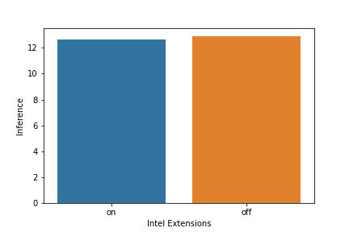
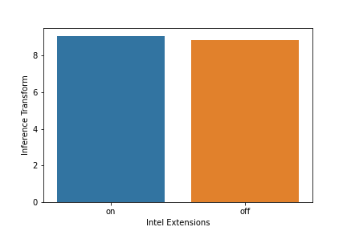
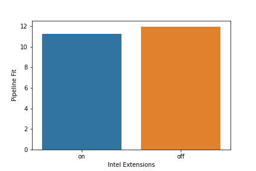

# T6: WaferInsights Workflow

WaferInsights is a python application that allows users to predict FMAX/IDV tokens based on multiple data sources measured in fab.

## Table of Contents
- [Implementation Details](#implementation-details)
    - [Architecture](#architecture)
    - [Software Dependencies](#software-dependencies)
    - [Performance](#performance)
    - [Dataset](#dataset)
- [Getting Started](#getting-started)
- [Usage](#usage)
    - [Data Preprocessing](#data-preprocessing)
    - [Training](#training)
    - [Inference](#inference)
- [License](#license)

## Implementation Details 

### Architecture
At its core, WaferInsights is an interactive data-visualization web application based on Dash and Plotly. It includes 2 major components: a data loader which generates synthetic fab data for visualization and a dash app which provides an interface for users to play around with the data and to gain insights of the data. Dash is written on top of Plotly.js and React.js and is an ideal framework for building and deploying data apps with customized user interfaces. The folder `src/dashboard` contains code of the dash app and the `src/loaders` folder contains code of the data loader. 

### Software Dependencies
The software dependencies can be found in the `env.yaml` and `requirements.txt`.

### Performance 

Inference           |  Inference Transformed          | Pipeline Fit|
:-------------------------:|:-------------------------:|:-------------------------:
  |   | 

The numbers shown in the plots are the timings for the different components with and without Intel optimizations. The Intel optimizations refer to Intel(R) Extension for Scikit-Learn being utilized where indicated. Inference shown in the image is the actual machine learning inference. Inference transformed is the data transforms associated with the inference pass. Pipeline fit are the data transform and machine learning model fit. The performance numbers can be produced with the benchmark script found in the `src` folder.

### Dataset
The actual measurement data from the fab are not allowed to be shared with the public, thus we provide a synthetic data loader to generate synthetic data using the `make_regression` function from sklearn, which has the following format:

| **Type**                 | **Format** | **Rows** | **Columns**|
| :---                     | :---       | :---      | :---   
| Feature Dataset          |  Parquet | 25000 | 2000
| Response Dataset         |  Parquet | 25000 | 1

The generated features and responses are saved separately in different folders under `data/synthetic_etest` and `data/synthetic_response`.


## Getting Started 

> **Note:** The code is developed and tested on a machine with following configurations. But it would be sufficient to have a machine much less powerful than the used one.

| **Name**:                         | **Description**
| :---                              | :---
| CPU                               | Intel(R) Xeon(R) Gold 6252N CPU @ 2.30GHz (96 vCPUs)
| Free RAM                          | 367 GiB/376 GiB
| Disk Size                         | 2 TB


First, set up the environment with conda using 
```bash
conda create -n WI 
conda activate WI
pip install dash scikit-learn pandas pyarrow colorlover
````
Then pull the repo and get started to use it

```bash
git clone https://github.com/intel-sandbox/applications.ai.appliedml.workflow.waferinsights.git
cd applications.ai.appliedml.workflow.waferinsights
```

## Usage
To generate synthetic data for testing from root directory:
```bash
cd src/loaders/synthetic/loader
python loader.py
```

To run the dashboard:

```bash
export PYTHONPATH=$PYTHONPATH:$PWD
python src/dashboard/app.py
```

The default dashboard URL is:
http://0.0.0.0:8050/


## License
[Apache License 2.0](LICENSE)
